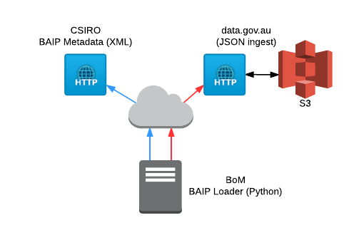

.. BAIP Loader documentation master file

BAIP - Loader
=============

.. toctree::
    :maxdepth: 2

    contents.rst

The BAIP Loader is a fit-for-purpose extract and load tool.  In this
workflow, the Loader:

* extracts BAIP CSIRO metadata as an ANZLIC-compliant XML structure
* translates ANZLIC-compliant XML into a JSON data structure
* adds CKAN metadata fields
* loads the JSON data structure into CKAN

The following diagram describes the interfaces at a high-level:

The BAIP Loader tool is a command line utility, ``baip-loader`` that
manages the workflow via the :ref:`scraper`, :ref:`mapper` and
:ref:`dumper` subcommands.

Indices and tables
==================

* :ref:`genindex`
* :ref:`modindex`
* :ref:`search`
